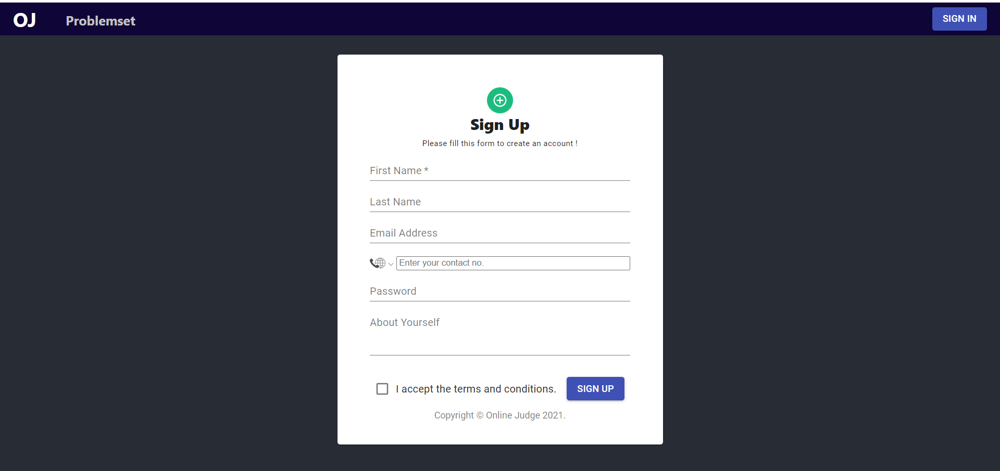
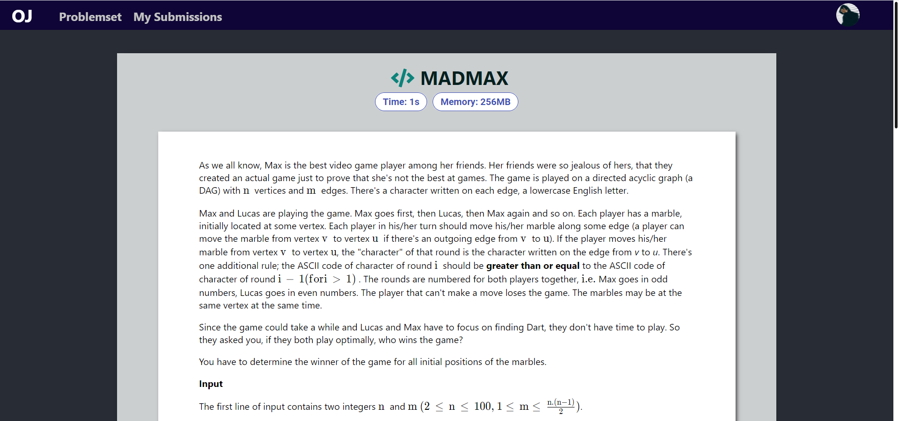
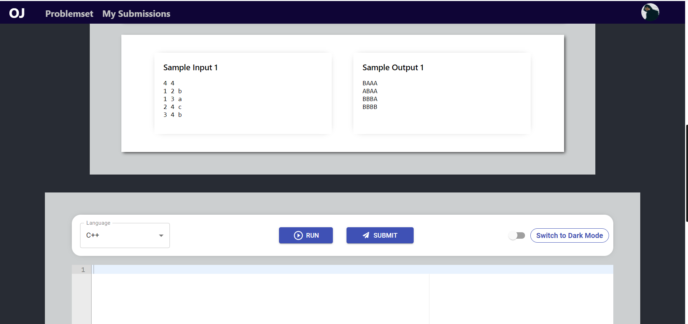
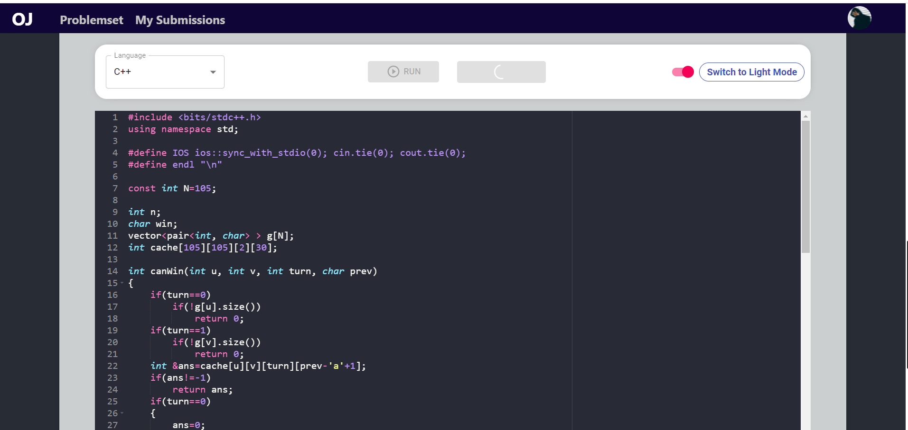
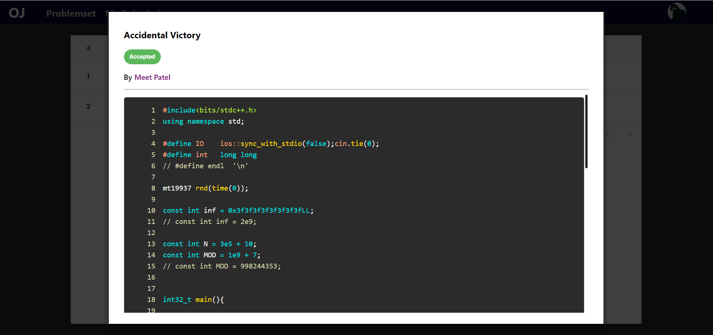
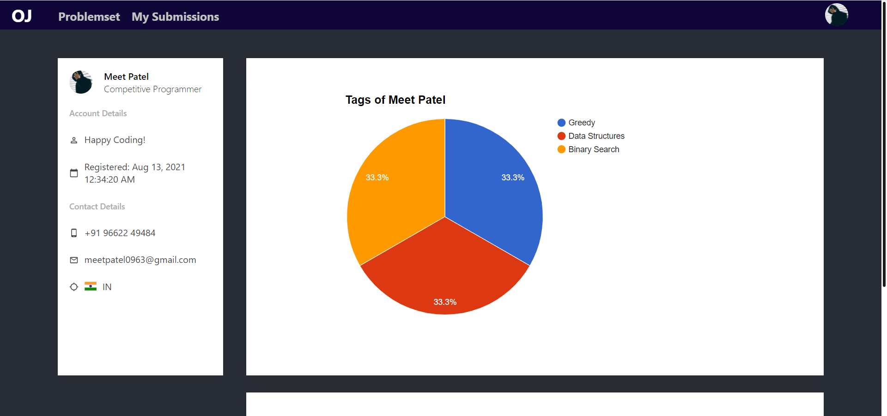
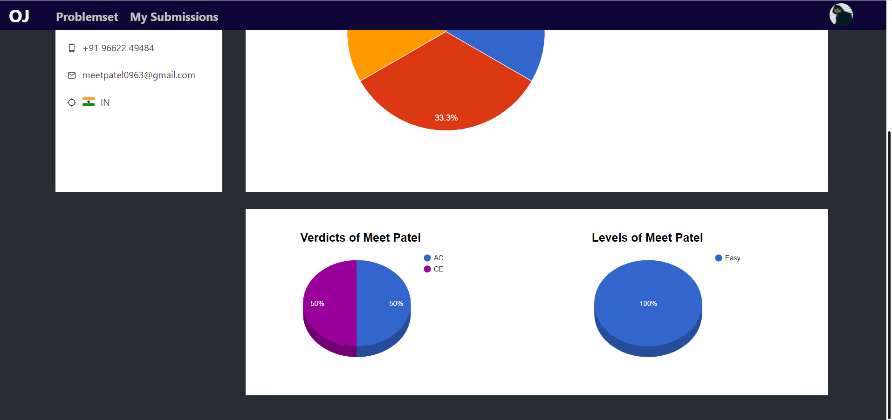

# LogicLabs: Online-Judge

> #### An Online-judge system based on Node and React (MERN Stack).

## Features

- [x] Authentication and Authorization
- [x] Submit your code
- [x] Test your code
- [x] Results shows Time (Sec) and Memory (MB)
- [x] Verdicts
  - Time Limit Exceeded (TLE) 
  - Memory Limit Exceeded (MLE) 
  - Compilation Error (CE) 
  - Runtime Error (RTE) 
  - Wrong Answer (WA) 
  - Accepted (AC) 
- [x] See your submissions
- [x] Filter problems based on tags
- [x] Search problems by name
- [x] Dashboard for Statistics
- [x] Create Coding Problems
- [ ] E-mail verification
- [ ] Forgot password
- [ ] Leaderboard

## Supported Languages

- C
- C++ 11/14/17 (GCC)
- Java 8
- Python 3

## Prerequisite

- Docker Desktop
- Node.js
- java: openjdk 16.0.2
- apache-maven-3.8.1

## Env Variables

> #### In judge/config/config.js:

```
PORT = 5000
JWT_PRIVATE_KEY = <Your_JWT_Token>
BACK_SERVER_URL = <Spring_Server_URL>
```

## Setup Locally

### Make sure to install docker in your machine.

> #### Start Docker Desktop

```bash
git clone https://github.com/meetpatel0963/Online-judge.git
cd online-judge
```

### Client

> #### In client: Create env file with referencing the env.example

```bash
cd client
npm install
npm start
```

### Server

> #### create file `server/src/main/resources/application.properties`
>
> #### Start Spring Boot Server

- set these in application.properties file referencing the application.properties.example

```bash
spring.data.mongodb.uri=mongodb_server_url
app.jwtSecret=happycoding
app.jwtExpirationInMs=604800000
```

```bash
cd server
mvn clean package
```

> #### Start node js judge server

```bash
cd judge
mkdir submissions
npm install
cd docker
docker build -t online-judge .
cd ..
npm start
```

### Make sure to start Docker Desktop before the command npm start.

🎉 And that's it! You will now be able to visit <a href="http://localhost:3000/">http://localhost:3000/</a> URL and see your application up and running.

## Snapshots

### SignIn


### SignUp



### ProblemSet


### Problem Page




### Code Editor



### Results


### Add Problem Page


### User Submissions


### User Submission Modal



### Dashboard Charts



### Dashboard Charts



## Thanks

- I'd appreciate a star if you find this helpful.

## License

[MIT](http://opensource.org/licenses/MIT)
